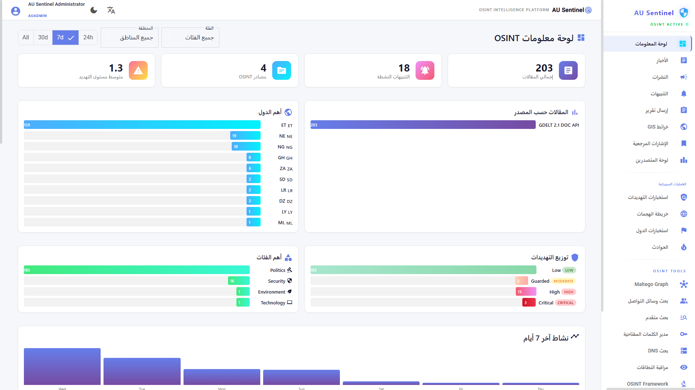
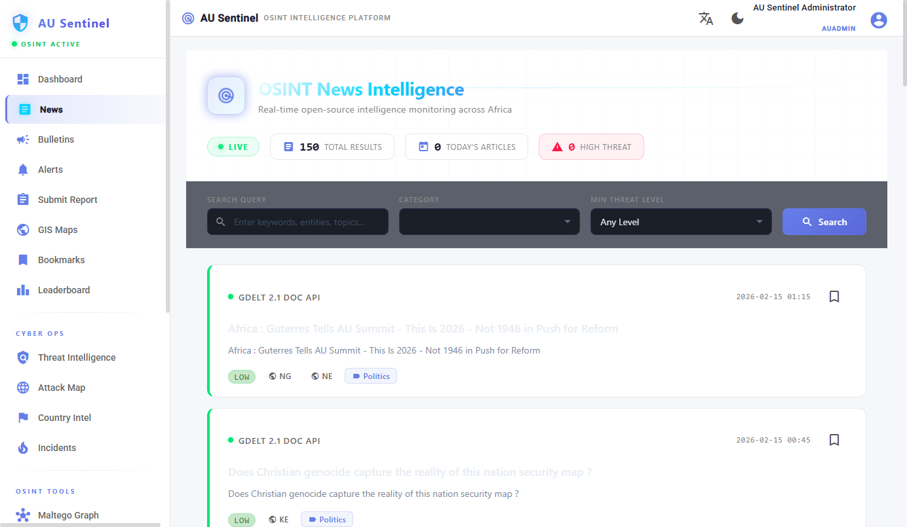
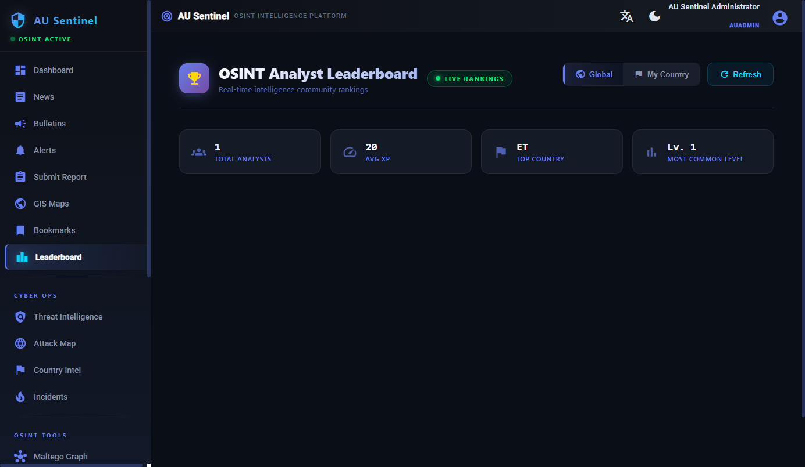
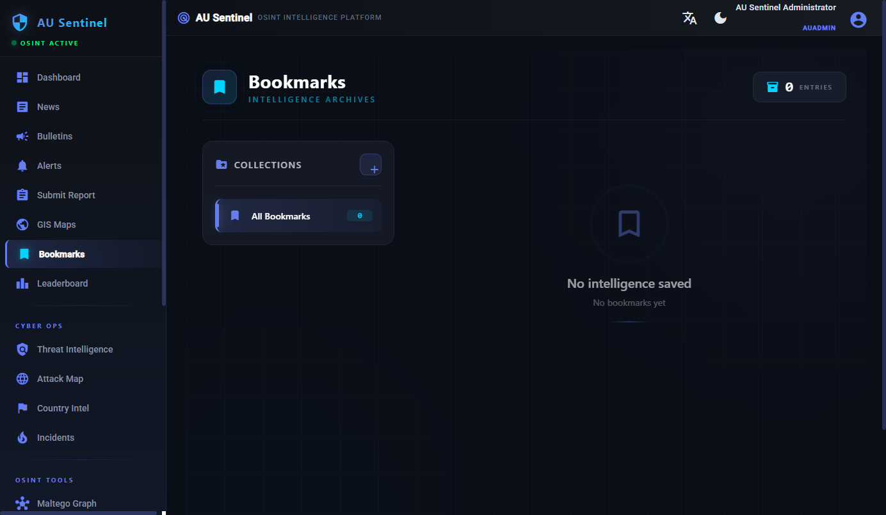

# AU Sentinel

**OSINT Intelligence Platform for African Union Member States**

AU Sentinel is a comprehensive platform that aggregates real-time news from open-source intelligence feeds, classifies articles by threat level, and serves them through a country-scoped dashboard with alerts, cyber intelligence tools, and multi-language support (English, Arabic, French) with full RTL layout.

---

## Screenshots

| Dashboard (Dark) | Dashboard (Arabic RTL) |
|:---:|:---:|
|  |  |

| News (Light) | Threat Intelligence |
|:---:|:---:|
|  |  |

| Leaderboard | Bookmarks |
|:---:|:---:|
|  |  |

---

## Features

### Core Platform
- Dark/light theme with CSS variable system
- Multi-language support (English, Arabic, French) with automatic RTL layout
- JWT authentication & role-based authorization (User, Editor, CountryAdmin, AUAdmin)
- Dev auto-login middleware for seamless local development
- Country-scoped multi-tenancy with audit logging

### OSINT Data Sources
- **GDELT 2.1 DOC API** - Global event monitoring for Africa
- **ReliefWeb** - Humanitarian crisis reporting
- **AllAfrica** - Pan-African news aggregation
- **WHO Disease Outbreaks** - Health emergency tracking
- **UN News** - United Nations Africa coverage

### Intelligence & Analysis
- OSINT dashboard with stats, charts, threat distribution, and activity timeline
- Threat level classification (Low / Guarded / High / Critical)
- Community voting (REAL / MISLEADING / UNSURE)
- Maltego-style entity relationship graph visualization
- Social media search (Twitter/X, Reddit, Facebook, Telegram, Dark Web)
- Advanced search with boolean operators (AND/OR/NOT), phrase matching, wildcards
- DNS lookup & analysis (A/MX/TXT/NS records, IP geolocation, risk scoring)
- Domain watchlist (Monitor/Block/Trust with detection tracking)
- Country intelligence profiles
- Cyber attack map & incident tracker
- OSINT framework tool directory

### Content Management
- News articles with source attribution and country tagging
- Bulletin management with draft/review/publish workflow and file attachments
- Submit reports from the field
- Alert rules with configurable notifications
- Bookmark articles with custom collections
- Keyword list management
- Bulk CSV import (Articles, Users, Sources, Keywords)

### User Engagement
- Gamification system with XP, 10 levels (Novice to Elite), and 22 badges
- Leaderboard with global/country rankings
- User profiles with avatars and metadata

---

## Architecture

```
 GDELT / ReliefWeb / AllAfrica / WHO / UN News
                    |
                    v
            +-----------------+
            |  Fetcher Svcs   |  (staggered startup)
            +-----------------+
                    |
                    v
              PostgreSQL / InMemory
                    |
                    v
             ASP.NET Core API  (:9099)
                    |
                    v
             Angular Frontend  (:4100)
```

| Layer          | Technology                              |
|----------------|-----------------------------------------|
| Frontend       | Angular 17, Angular Material, Signals   |
| Backend API    | ASP.NET Core 8, Entity Framework Core   |
| Database       | PostgreSQL 16 (InMemory fallback)       |
| Cache          | Redis 7 (MemoryCache fallback)          |
| Search         | OpenSearch 2.x (optional)               |
| Message Queue  | RabbitMQ 3.x (optional)                 |
| Auth           | JWT Bearer with BCrypt hashing          |
| i18n           | @ngx-translate (en, ar, fr)             |

---

## Project Structure

```
osentLib/
├── backend/
│   └── api/                       # REST API (ASP.NET Core 8)
│       ├── Controllers/           # 14 API controllers
│       ├── Services/              # Business logic + OSINT fetchers
│       ├── Data/                  # DbContext, entities, seed data
│       ├── Models/                # DTOs and request/response models
│       ├── Middleware/            # Auth, country scoping, audit log
│       └── Validators/           # FluentValidation rules
├── frontend/
│   └── src/
│       ├── app/
│       │   ├── core/              # Services, guards, interceptors
│       │   ├── features/          # 20+ feature components
│       │   │   ├── dashboard/     # OSINT dashboard with charts
│       │   │   ├── news/          # News list & detail
│       │   │   ├── bulletins/     # Bulletin CRUD
│       │   │   ├── alerts/        # Alerts & alert rules
│       │   │   ├── cyber/         # Threat intel, attack map, incidents
│       │   │   ├── maltego/       # Entity graph visualization
│       │   │   ├── social-search/ # Multi-platform social search
│       │   │   ├── dns/           # DNS lookup & domain watchlist
│       │   │   ├── search/        # Advanced search & keywords
│       │   │   ├── maps/          # Threat, alert, timeline maps
│       │   │   ├── reports/       # Submit reports
│       │   │   ├── admin/         # Users, sources, import
│       │   │   └── ...
│       │   └── shared/            # Reusable components
│       ├── assets/i18n/           # Translations (en, ar, fr)
│       └── styles/                # Global styles, dark theme, RTL
├── screen/                        # Screenshots (dark/light/RTL)
└── cdp-*.js                       # Dev screenshot utilities
```

---

## Quick Start

### Prerequisites

- [.NET 8 SDK](https://dotnet.microsoft.com/download/dotnet/8.0)
- [Node.js 18+](https://nodejs.org/)
- PostgreSQL 16 (optional - falls back to InMemory database)

### Launch

```bash
# 1. Start backend API
cd backend/api
dotnet restore
dotnet run

# 2. Start frontend (new terminal)
cd frontend
npm install    # first time only
npm start
```

The backend auto-detects available services (PostgreSQL, Redis) and falls back to in-memory alternatives, so no Docker infrastructure is required for development.

### Access Points

| Service         | URL                           |
|-----------------|-------------------------------|
| Web App         | http://localhost:4100          |
| API             | http://localhost:9099          |
| Swagger Docs    | http://localhost:9099/swagger  |

### Default Credentials

- **Admin:** admin / Admin123!

In development mode, the auto-login middleware automatically authenticates all requests as the admin user, so no login is required.

---

## Development

### Backend

```bash
cd backend/api
dotnet restore           # Restore packages
dotnet run               # Start API on port 9099
dotnet watch run         # Start with hot reload
```

### Frontend

```bash
cd frontend
npm install              # Install dependencies
npm start                # Dev server on port 4100 (proxies /api to :9099)
npm run build            # Production build
```

### Screenshots

CDP-based screenshot scripts are included for automated visual testing:

```bash
node cdp-screenshot-dashboard.js   # Capture dashboard
node screenshot-theme-verify.js    # Capture all pages in dark/light
```

---

## Security

- JWT-based authentication with configurable expiry
- Role-based authorization (User, Editor, CountryAdmin, AUAdmin)
- Country-scoped multi-tenancy isolation
- BCrypt password hashing
- CORS protection
- Input validation (FluentValidation)
- SQL injection prevention (EF Core parameterization)
- XSS protection (Angular sanitization)

---

## Roadmap

- [x] Phase 1: Foundation (i18n, User Profiles, Auth)
- [x] Phase 2: User Engagement (Bookmarks, XP, Badges, Leaderboard)
- [x] Phase 3: Enhanced Search (Advanced Query, Bulk Import, Keywords)
- [x] Phase 4: Intelligence Tools (DNS Lookup, Domain Watchlist)
- [x] Phase 5: Real OSINT Data (GDELT, ReliefWeb, AllAfrica, WHO, UN News)
- [x] Phase 6: Cyber Operations (Threat Intel, Attack Map, Incidents, Country Intel)
- [x] Phase 7: OSINT Tools (Maltego Graph, Social Search, OSINT Framework)
- [x] Phase 8: Theme System (Dark/Light modes, RTL Arabic support)
- [ ] Phase 9: Advanced AI (Article classification, entity extraction)
- [ ] Phase 10: Real-time (WebSocket alerts, live feed updates)

---

## License

Proprietary - African Union Member States

---

**Version:** 1.1.0
